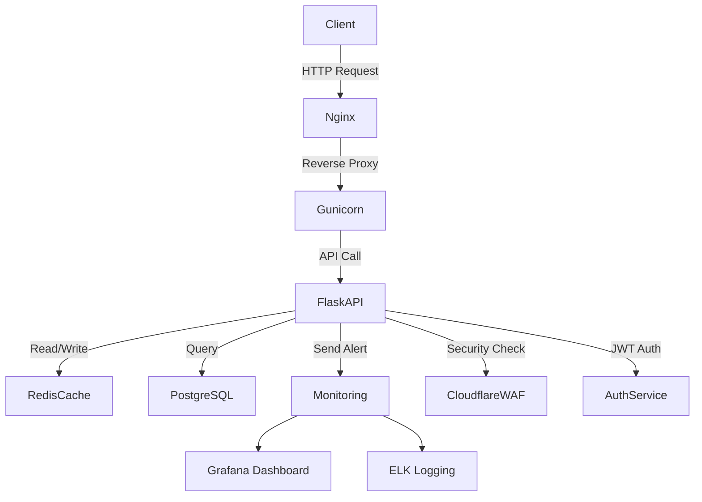

# Flask API Hardening & Performance Optimization

**Secure, Scalable, and High-Performance Flask APIs**

---

## 🌟 Project Aim / Vision

This project focuses on **enhancing the security and performance of Flask-based APIs** for high-traffic applications. It addresses common vulnerabilities, protects endpoints from bot attacks, and implements infrastructure-aware optimizations to ensure **scalable, reliable, and production-ready backend systems**.

---

## 🛠 Core Technologies

- **Backend Framework:** Flask 🐍
- **Caching & Queues:** Redis, Celery
- **Web Server:** Gunicorn, Nginx
- **Security:** Cloudflare WAF, IP Whitelisting, JWT Auth, Rate Limiting
- **Monitoring & Logging:** Prometheus, Grafana, ELK Stack
- **Containerization & Deployment:** Docker, Docker Compose, Linux

---

## 📦 Planned Features / Modules

1. **API Hardening**
   - Input validation, secure authentication, and JWT token management
   - Role-based access and endpoint authorization
   - IP whitelisting and throttling mechanisms
2. **Bot & Traffic Mitigation**
   - Rate limiting per endpoint
   - Integration with Cloudflare WAF for advanced protection
   - Logging suspicious activity for automated alerts
3. **Performance Optimization**
   - Query optimization and Redis caching for high-speed response
   - Gunicorn worker tuning for concurrency
   - Nginx configuration for request load balancing
4. **Monitoring & Alerts**
   - Real-time metrics for API health
   - Log aggregation and alerts for failures or spikes
5. **Scalable Architecture**
   - Modular, production-ready architecture
   - Prepared for deployment in containerized or serverless environments

---

## 🏗 High-Level Architecture

## ⚙️ Development & Configuration

- Clone repo and install dependencies using `pip install -r requirements.txt`
- Use `.env` for environment variables (Redis, DB, API keys)
- Configure Gunicorn/Nginx locally or via Docker for production simulation
- Optional: Run `docker-compose up` for full containerized setup

---

## 🚀 Roadmap / Next Steps

- **Phase 1:** Implement core Flask API endpoints, security hardening, rate limiting
- **Phase 2:** Integrate Redis caching and background tasks (Celery)
- **Phase 3:** Deploy Docker containers and tune Gunicorn/Nginx for concurrency
- **Phase 4:** Implement Cloudflare WAF rules and IP throttling
- **Phase 5:** Set up monitoring dashboards and alerting pipelines
- **Phase 6:** Prepare for horizontal scaling and multi-region deployment

---

## 🔍 Technologies

Flask, Python, Backend Security, API Hardening, REST API, High Traffic APIs, Performance Optimization, Redis, Gunicorn, Nginx, Cloudflare WAF, JWT Authentication, IP Whitelisting, Rate Limiting, System Optimization, Scalable Backend, Production-Ready APIs, Monitoring, Logging, Docker, Containerized Backend, Modular Architecture
